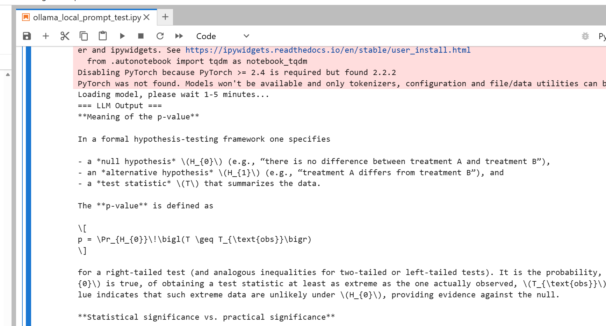
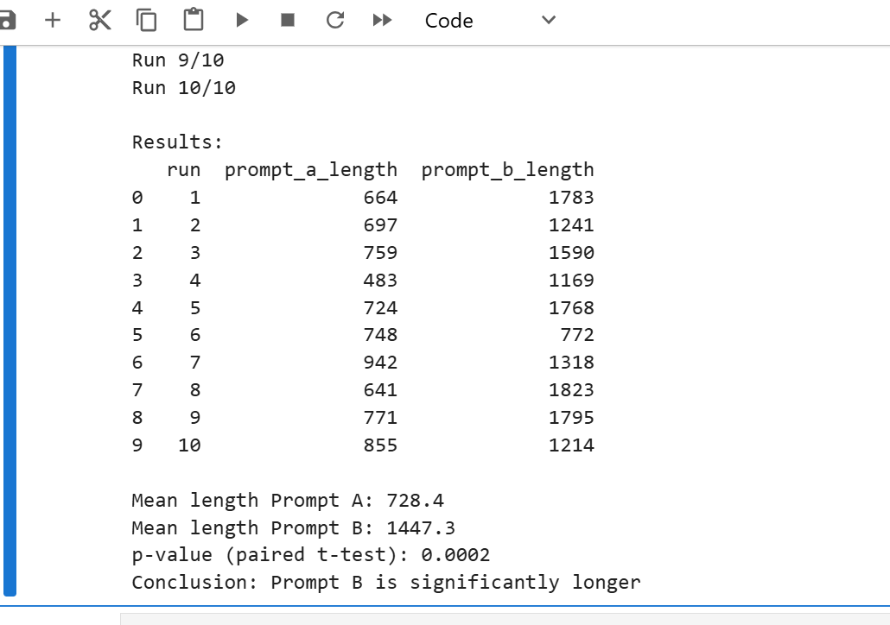

# llm-evaluation-with-statistics
LLM evaluation frameworks using statistical methods (p-value, confidence intervals, A/B testing) with LangChain + Ollama
# LLM Evaluation Framework with Statistical Methods

This repository contains my experiments and frameworks for evaluating Large Language Models (LLMs) using statistical rigor, built with LangChain + Ollama (local inference).

## Background
- Statistics MS graduate
- 7+ years in test development & quality assurance
- Transitioning to AI/LLM evaluation roles

## Key Projects

1. **Local LLM Demo with Ollama + LangChain**  
   - Model: gpt-oss:20b  
   - Basic prompt engineering and statistical question answering  
   - [Local LLM Evaluation Demo with Ollama & LangChain](https://github.com/jasonhuang680/llm-evaluation-with-statistics/blob/main/ollama_local_prompt_test.ipynb)  
   - Screenshot: 
   -
2. **Prompt A/B Testing with Statistical Significance**
   - Compared two prompt variants (simple vs. few-shot + chain-of-thought) on the same statistical question
   - Ran 10 trials each, measured response length
   - Results: Prompt B produced significantly longer responses (p-value < 0.05, paired t-test)
   - [Notebook: prompt_ab_testing_demo.ipynb](https://github.com/jasonhuang680/llm-evaluation-with-statistics/blob/main/prompt_ab_testing_demo.ipynb)
   - Screenshot: 

3. **Hallucination Detection**
   - Statistical confidence intervals on model outputs

## Tech Stack
- Python, LangChain, Ollama (local LLM)
- Statistical tools: pandas, scipy, statsmodels

## How to Run
1. Install Ollama and pull model: `ollama run gpt-oss:20b`
2. pip install langchain-ollama langchain-core
3. Run the notebook

Feel free to fork or reach out!

LinkedIn: https://www.linkedin.com/in/yongchao-h-b90441101/
X: @YCHuangSC
