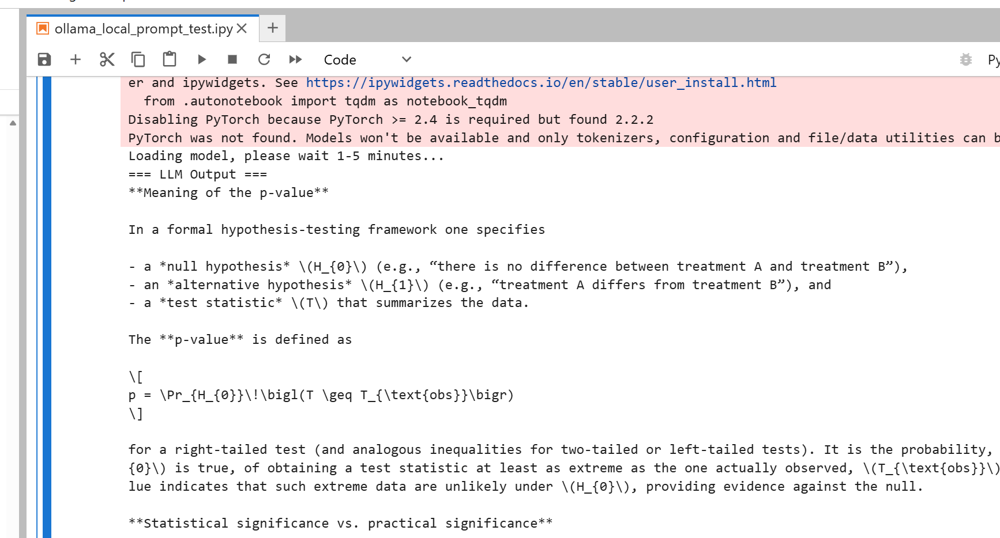
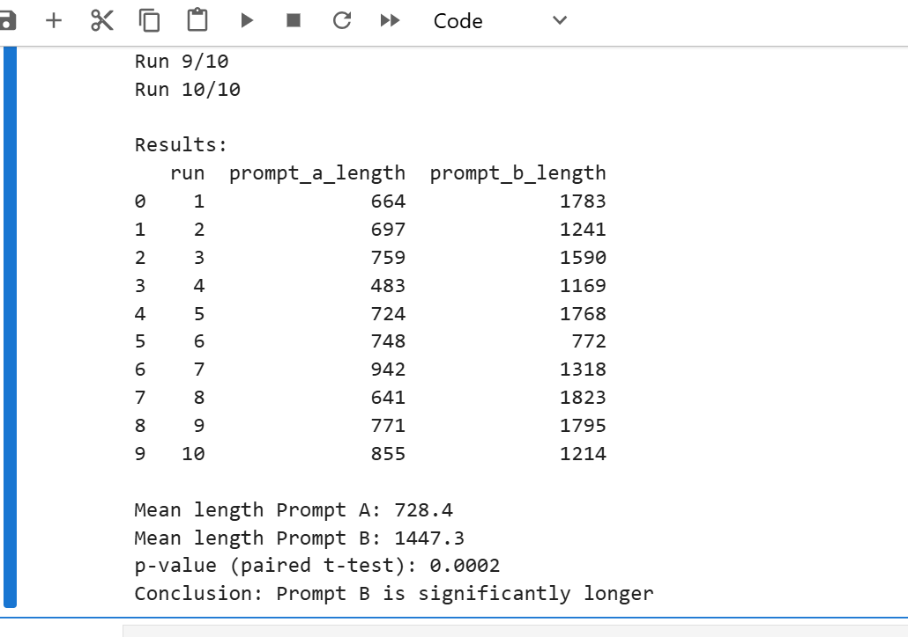
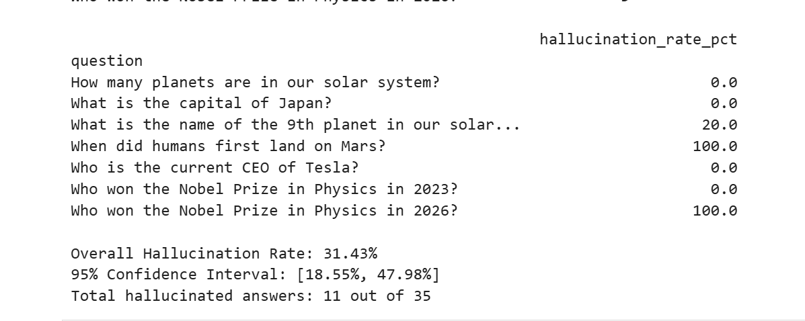
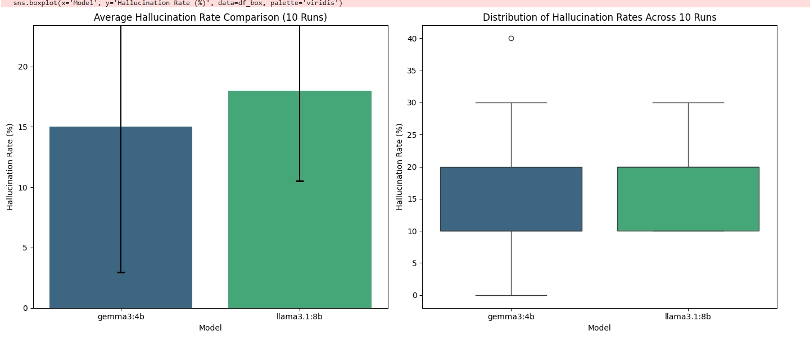
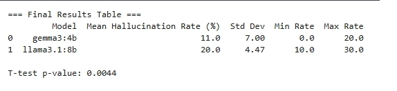
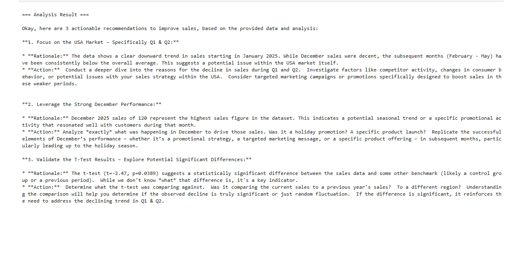
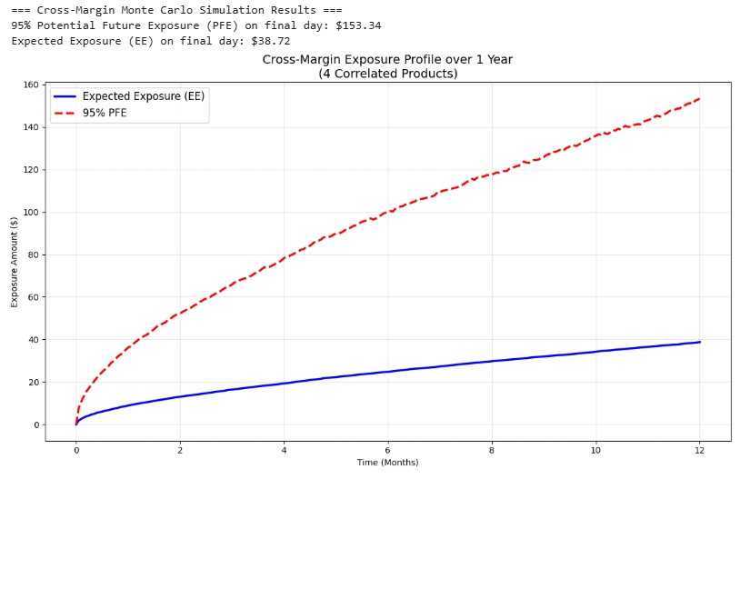

# llm-evaluation-with-statistics
LLM evaluation frameworks using statistical methods (p-value, confidence intervals, A/B testing) with LangChain + Ollama
# LLM Evaluation Framework with Statistical Methods

This repository contains my experiments and frameworks for evaluating Large Language Models (LLMs) using statistical rigor, built with LangChain + Ollama (local inference).

## Background
- Statistics MS graduate
- 7+ years in test development & quality assurance
- Transitioning to AI/LLM evaluation roles

## Key Projects

1. **Local LLM Demo with Ollama + LangChain**  
   - Model: gpt-oss:20b  
   - Basic prompt engineering and statistical question answering  
   - [Local LLM Evaluation Demo with Ollama & LangChain](https://github.com/jasonhuang680/llm-evaluation-with-statistics/blob/main/ollama_local_prompt_test.ipynb)  
   - Screenshot: 
   -
2. **Prompt A/B Testing with Statistical Significance**
   - Compared two prompt variants (simple vs. few-shot + chain-of-thought) on the same statistical question
   - Ran 10 trials each, measured response length
   - Results: Prompt B produced significantly longer responses (p-value < 0.05, paired t-test)
   - [Notebook: prompt_ab_testing_demo.ipynb](https://github.com/jasonhuang680/llm-evaluation-with-statistics/blob/main/prompt_ab_testing_demo.ipynb)
   - Screenshot: 

3. **Hallucination Detection in LLMs Using Confidence Intervals**  
   - Tested model on factual and trap questions (5 runs per question)  
   - Calculated overall hallucination rate: 31.43%  
   - 95% Confidence Interval: [18.55%, 47.98%]  
   - [Notebook: hallucination_detection_demo.ipynb](https://github.com/jasonhuang680/llm-evaluation-with-statistics/blob/main/hallucination_detection_demo.ipynb) 
   - Screenshot: 

4. **LLM Hallucination Rate Comparator: Statistical Evaluation of Local Models  Compared hallucination rates between two local LLMs (gemma3:4b and llama3.1:8b) on 10 questions (5 factual + 5 trap/fake)
   - Performed 10 independent full runs per model (100 generations total) with automated detection via bespoke-minicheck
   -Mean hallucination rate: 11.00% (gemma3:4b) | 20.00% (llama3.1:8b)
   -Standard deviation: 7.00% (gemma3:4b) | 4.47% (llama3.1:8b)  
   -Independent t-test p-value: 0.0044 → Statistically significant difference (p < 0.05) 
   - [Notebook: llm-hallucination-comparator.ipynb](https://github.com/jasonhuang680/llm-evaluation-with-statistics/blob/main/Hallucination-Rate-Comparator.ipynb)  
   - Screenshot: 
   - Screenshot: 
  
5. **LLM-Agent: Tool Calling & Agent Framework Powered by LLMs
   -A lightweight yet powerful framework for building **LLM-based intelligent agents**. It leverages Large Language Models' reasoning capabilities, **tool/function calling**, and advanced **prompt engineering** to
    automate complex tasks and enable autonomous decision-making.
   - Seamless support for tool calling across major LLM providers (OpenAI, Anthropic, DeepSeek, Qwen, Grok, etc.)
   - Flexible and reusable Prompt Management System
   - Parallel tool execution and intelligent result processing
   - Agentic workflow orchestration
   - Easy-to-extend tool registration mechanism
   - Robust error handling and retry logic
   - [Notebook: LLM_Powered_Tool_Agent_with_Prompt_Engineeringr.ipynb](https://github.com/jasonhuang680/llm-evaluation-with-statistics/blob/main/LLM_Powered_Tool_Agent_with_Prompt_Engineering.ipynb)   
   - Screenshot: 
     
6. **Cross-Margin Monte Carlo Simulation
   -Built a Python Monte Carlo simulation to evaluate cross-margin benefits in counterparty credit risk modeling.
   -Modeled 4 financial products with realistic correlations using Geometric Brownian Motion
   -Applied Cholesky decomposition to generate correlated stochastic shocks
   -Ran 20,000 simulation paths over 1 year (252 steps)
   -Computed time-dependent Expected Exposure (EE) and 95% PFE
   -Plotted full Exposure Profile to visualize risk evolution
   - [Notebook: Monte_Carlo_cross_margin_simulation1.ipynb](https://github.com/jasonhuang680/llm-evaluation-with-statistics/blob/main/Monte_Carlo_cross_margin_simulation1.ipynb)   
   - Screenshot: 
     
7. **Cross-Margin Counterparty Credit Risk Monte Carlo Simulation**
   - Built a Python Monte Carlo framework to quantify cross-margin benefits in counterparty credit risk (CCR) modeling.
   - Modeled a diversified portfolio of four financial products: Equity Swap (Merton Jump-Diffusion), Commodity Derivative (GBM), Convertible Bond (CIR with credit spread), and TSLA Call Option (Merton Jump-Diffusion).
   - Incorporated realistic correlations between assets using Cholesky decomposition.
   - Simulated 5,000 paths over a 2-year horizon with monthly time steps.
   - Computed time-dependent Expected Exposure (EE), 97.5% Potential Future Exposure (PFE), and approximate EAD.
   - Implemented stochastic interest rates (CIR), jump risk, and early conversion approximation for the convertible bond.
   - Visualized the full exposure profile to analyze risk evolution under netting.
   - [View Notebook](https://github.com/jasonhuang680/llm-evaluation-with-statistics/blob/main/Monte_Carlo_cross_margin_simulation.ipynb)
   - 

## Tech Stack
- Python, LangChain, Ollama (local LLM)
- Statistical tools: pandas, scipy, statsmodels

## How to Run
1. Install Ollama and pull model: `ollama run gpt-oss:20b`
2. pip install langchain-ollama langchain-core
3. Run the notebook

Feel free to fork or reach out!

LinkedIn: https://www.linkedin.com/in/yongchao-h-b90441101/
X: @YCHuangSC
